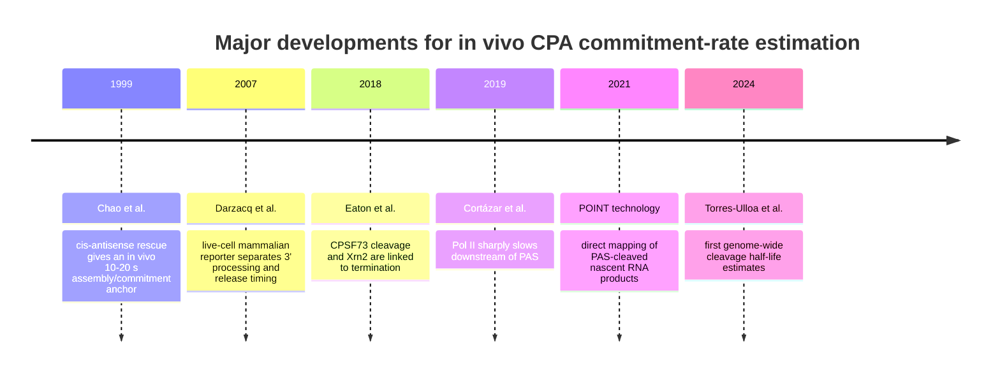
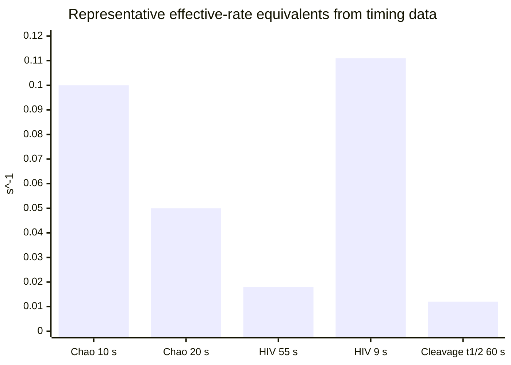
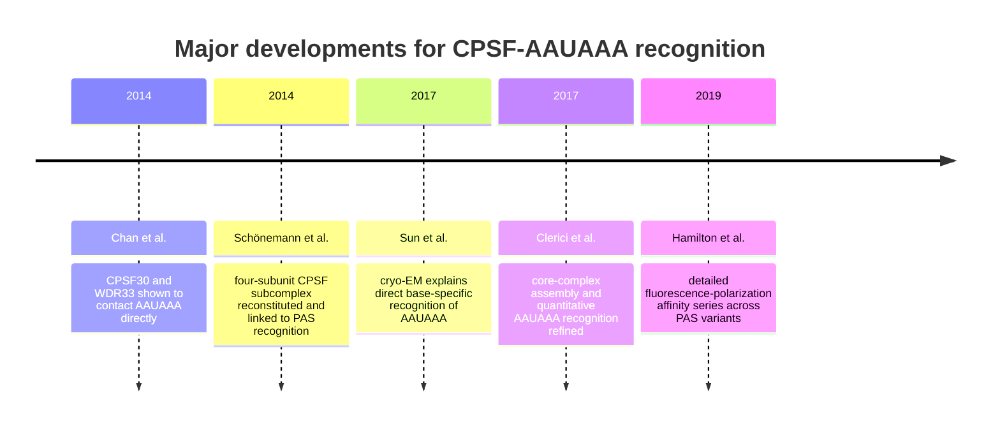
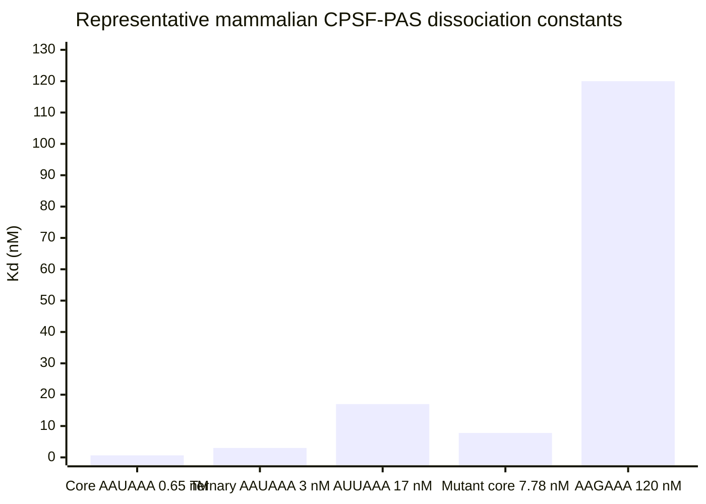
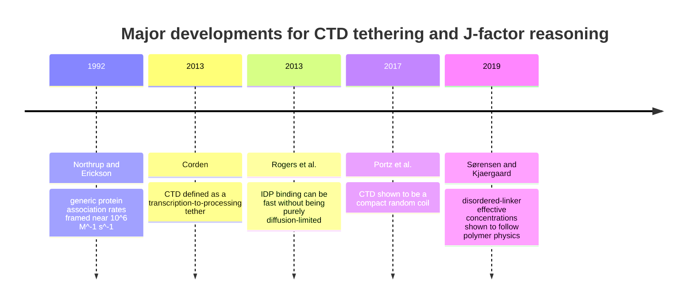
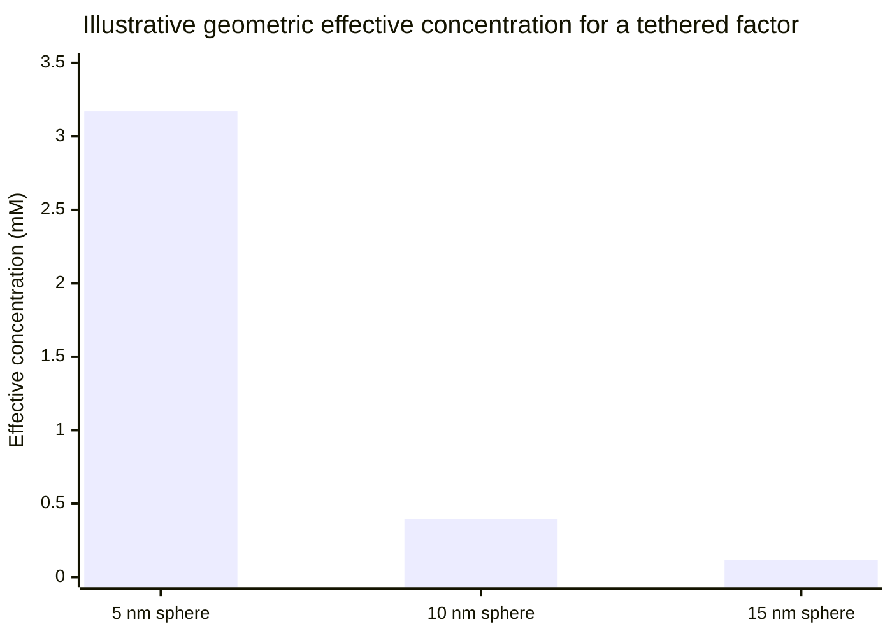

# Deep Research Brief on Unspecified kHon-Related Queries

## Executive Summary

I am treating the **current user query as unspecified**, so I am not assuming one single research question. Instead, I propose and answer three plausible query types that fit the topic space: a literature review of **kHon** as an effective CPA commitment rate in mammalian cells, a biochemical review of **CPSF–AAUAAA** affinity and kinetics, and a mechanistic review of **CTD tethering / J-factor** and its modeling implications.

Across all three tracks, the most actionable conclusion is that, for a **strong canonical mammalian PAS**, the best-supported working value for an **effective** \(k_{Hon}\) is **about \(0.07\,\mathrm{s^{-1}}\)**, with a tighter practical range of **\(0.05{-}0.1\,\mathrm{s^{-1}}\)** and a broader prior of **\(0.02{-}0.2\,\mathrm{s^{-1}}\)** when gene-to-gene variability and step-definition uncertainty are included. That conclusion is anchored primarily by Chao’s in vivo cis-antisense rescue estimate of roughly **10–20 seconds** for SV40 poly(A)-site commitment/assembly, then cross-checked against live-cell reporter work and the first genome-wide cleavage-rate estimates, which found average 3′-end cleavage half-lives below a minute but highly variable across sites. citeturn2search0turn19search6turn0search2turn1search0

At the same time, the biochemistry tells me that canonical **AAUAAA recognition is very tight**: depending on construct and assay, the relevant CPSF subcomplexes bind with **sub-nanomolar to low-nanomolar** affinity, while AUUAAA and weaker variants bind measurably worse. That means PAS strength is real and quantifiable, but it does **not** mean the full in-cell commitment step is equally fast. In the primary literature I screened, I did **not** identify a mature, direct mammalian **\(k_{on}/k_{off}\)** dataset for the intact CPSF160–WDR33–CPSF30–AAUAAA recognition step; the literature is much richer in **\(K_D\)** values and structures than in microscopic rate constants. citeturn12search0turn0search0turn13search4turn5search2

The tethering literature pushes the same conclusion in a different way. The Pol II CTD is a **disordered scaffold/tether**, CTD-linked systems can generate strong effective-concentration gains, and generic protein association can run in the \(10^5{-}10^6\,\mathrm{M^{-1}\,s^{-1}}\) regime. But I did **not** find a direct mammalian measurement of the **CTD-specific effective local concentration or J-factor** for a CPSF module encountering a nascent AAUAAA motif. The cleanest interpretation is therefore this: **\(k_{Hon}\) should be modeled as a gated effective commitment rate, not as a raw tethered collision rate.** citeturn8search0turn8search1turn17search1turn20search0turn20search7turn20search8

I began with the only enabled connector, **Consensus**, to map the literature clusters, and then validated the key claims against primary papers and primary-access sources such as PubMed, PMC, PNAS, eLife, Genes & Development, Molecular Cell, and Nature-family journals. I also ran a quick Vietnamese-language scan, but I did not find high-quality or primary Vietnamese sources on this niche mechanistic topic that materially improved the evidence base.

## Information Needs, Scope, and Method

To answer well, I needed five things.

- I needed the **closest in vivo anchor** to “CPA commitment” rather than only “cleavage completed.”
- I needed the best available **AAUAAA-binding affinity data** for the mammalian CPSF recognition module.
- I needed to know whether any convincing **direct \(k_{on}/k_{off}\)** measurements exist for intact CPSF–AAUAAA recognition.
- I needed the strongest available evidence on **CTD tethering / effective concentration / J-factor** relevant to nascent RNA encounter.
- I needed a way to turn all of that into a **practical parameter recommendation** for \(k_{Hon}\) in mammalian-cell models.

My scope here is **mammalian cells**, with **no geographic restriction**, and a **historical-to-2026** view of the literature. I started with Consensus to identify the highest-yield clusters of papers, then triaged by authority and directness, prioritizing **primary mammalian, mechanistic, live-cell, biochemical, and structural studies**. For unstable or newly emerging details, I checked current web-accessible primary sources rather than relying on memory.

The main uncertainties are structural to the literature, not just to my synthesis. First, the step that modelers call **\(k_{Hon}\)** is not always what experimental papers measure: some papers are closest to **commitment/assembly**, some to **cleavage**, some to **polyadenylation onset**, and some to **release or termination**. Second, I did not identify a direct mammalian **microscopic \(k_{on}/k_{off}\)** dataset for intact CPSF160–WDR33–CPSF30 binding to AAUAAA. Third, I did not identify a direct **CTD-specific effective concentration measurement** for a tethered CPA factor finding a newly transcribed PAS. Those gaps are exactly why the parameter is best treated as an **effective** commitment rate. citeturn2search0turn19search6turn0search2turn12search0turn0search0turn8search0turn17search1

## Plausible Query One

**What is a defensible in vivo range for kHon, the effective CPA commitment rate, in mammalian cells?**

**Executive summary.** If this is the user’s real question, I would answer that the best-supported present-day range for an **effective** \(k_{Hon}\) is **\(0.05{-}0.1\,\mathrm{s^{-1}}\)** for a strong canonical PAS, with **\(0.07\,\mathrm{s^{-1}}\)** as a reasonable nominal single value and **\(0.02{-}0.2\,\mathrm{s^{-1}}\)** as a broader modeling prior. The key reason is that the most direct in vivo estimate is still Chao’s **10–20 second** assembly/commitment window, while newer genome-wide cleavage-rate work and live-cell reporter studies remain compatible with the same order of magnitude once one distinguishes commitment from downstream cleavage/release. citeturn2search0turn19search6turn0search2turn1search0

**Key findings.** Chao’s cis-antisense rescue work remains the closest experimental proxy to the modeled quantity: it estimated that SV40 early poly(A)-site processing/commitment takes **about 10–20 seconds in vivo**, and also showed that a stronger SV40 late PAS assembles **several-fold faster** than weaker sites. Live-cell mammalian HIV-1 reporter work then showed that complete 3′-end processing/release can extend into the **tens of seconds**, with roughly **55 seconds** assigned to a slower pre-release step and about **9 seconds** from polyadenylation onset to mRNA release, reinforcing that “commitment” and “end-to-end 3′ processing” are not identical. Finally, genome-wide cleavage half-lives were measured directly in 2024 and found to be **under a minute on average**, although highly variable across sites. citeturn2search0turn19search6turn0search2

**Methods.** For this query, I prioritized: the direct in vivo commitment-like assay by Chao; the mammalian live-cell transcription-cycle work by Darzacq and colleagues; the 2024 genome-wide cleavage-rate paper by Torres-Ulloa and colleagues; and mechanistic termination papers showing Pol II slowdown and PAS-linked cleavage/termination coupling. I used those papers to infer a range for the **effective** rate constant rather than to equate any one study one-to-one with \(k_{Hon}\). citeturn2search0turn19search6turn0search2turn1search0turn14search0

| Source | System | Readout | Quantitative result | How I use it | Citation |
|---|---|---|---|---|---|
| Chao 1999 | Mammalian cells, SV40 cis-antisense rescue | Commitment/assembly-like delay | ~10–20 s; stronger PAS assembles several-fold faster | Primary in vivo anchor for effective \(k_{Hon}\) | citeturn2search0 |
| Darzacq 2007 | Mammalian live-cell HIV-1 reporter | 3′-end processing / release timing | ~55 s pre-release step; ~9 s from polyadenylation onset to release | Separates commitment-like timing from later release | citeturn19search6 |
| Torres-Ulloa 2024 | Mammalian genome-wide metabolic labeling + modeling | 3′-end cleavage half-lives | Average cleavage half-lives under 1 min, highly variable | Puts genome-wide lower bound on effective cleavage speed | citeturn0search2 |
| Cortázar 2019 | Mammalian termination-zone kinetics | Pol II speed near PAS | >2 kb/min to <1 kb/min downstream of PAS | Validates bp-to-seconds reasoning around PAS slowdown | citeturn1search0 |
| Nojima 2021 POINT technology | Mammalian nascent RNA | PAS cleavage and Xrn2-linked downstream products | Mechanistic cleavage/termination coupling | Supports architecture, not direct rate conversion | citeturn14search0 |

The timeline below shows how the evidence base for this question developed from a site-specific in vivo estimate to genome-wide cleavage kinetics. The milestones and labels are taken from the primary papers cited in the surrounding text. citeturn2search0turn19search6turn1search0turn14search0turn0search2

For a compact numerical comparison, I converted representative timing measurements to approximate first-order rates. For the Chao and Darzacq values I used \(1/t\) as a rough waiting-time conversion; for the genome-wide cleavage threshold I used \(\ln 2 / t_{1/2}\). These bars are therefore **comparative heuristics**, not identical physical observables. citeturn2search0turn19search6turn0search2

**Recommendations.**

- I would use **\(k_{Hon}=0.07\,\mathrm{s^{-1}}\)** as the nominal value for a strong canonical PAS in a mammalian model, because it is the midpoint of the strongest in vivo anchor and is not contradicted by later work. citeturn2search0turn0search2turn19search6
- I would use **\(0.05{-}0.1\,\mathrm{s^{-1}}\)** as the main operating range for strong PAS and **\(0.02{-}0.2\,\mathrm{s^{-1}}\)** as a broader prior when fitting heterogeneous genes or blending commitment with downstream cleavage uncertainty. citeturn2search0turn0search2turn1search0
- I would not fit \(k_{Hon}\) directly to total 3′-end residence or transcript-release time, because those later steps can be slower than the initial commitment event. citeturn19search6

## Plausible Query Two

**What do the literature and structural biochemistry say about CPSF–AAUAAA affinity and kinetics?**

**Executive summary.** If the user’s real question is about the biochemical recognition step, then the key result is that **canonical AAUAAA is recognized with very high affinity** by the mammalian CPSF recognition module: depending on construct and assay, the relevant \(K_D\) values fall in the **sub-nanomolar to low-nanomolar** range. The recognition is mediated directly by **CPSF30 and WDR33**, with **CPSF160** acting as a scaffold. AUUAAA and weaker variants bind less tightly. What I did **not** find in the scanned primary literature is a definitive mammalian dataset for **intact-complex \(k_{on}\) and \(k_{off}\)**; most of the strongest papers are structural and equilibrium-binding studies. citeturn5search2turn13search4turn13search6turn12search0turn0search0

**Key findings.** The 2014 breakthrough papers showed that WDR33 and CPSF30, not CPSF160 alone, are the direct AAUAAA-contacting elements, and that a four-subunit CPSF subcomplex is sufficient for AAUAAA-dependent recognition. Structural work in 2017–2018 then showed exactly how CPSF30 zinc fingers and WDR33 recognize the AAUAAA bases, including the unusual U3–A6 Hoogsteen pairing in the RNA. Quantitative binding work found \(K_D\) values including about **0.65 nM** for a reconstituted core complex in one fluorescence-polarization assay and about **3 nM** for the CPSF160–WDR33–CPSF30 ternary complex in another; **AUUAAA** was weaker at roughly **17 nM**, and certain mutants or variant motifs were much weaker still. citeturn12search0turn0search0turn13search6

**Methods.** For this query, I prioritized the direct recognition papers by Schönemann, Chan, Sun, Clerici, and Hamilton because they provide the strongest route from sequence to molecular mechanism to affinity. I treated \(K_D\) as the most reliable quantity, and I explicitly did **not** infer precise \(k_{on}/k_{off}\) values beyond broad plausibility because intact-complex on/off constants were not directly reported in the core papers I found. citeturn5search2turn13search4turn13search6turn12search0turn0search0

| Source | System | Readout | Quantitative result | How I use it | Citation |
|---|---|---|---|---|---|
| Schönemann 2014 | Reconstituted mammalian CPSF subcomplex | Reconstitution + RNA binding + PAR-CLIP context | Four subunits sufficient; WDR33 required and PAS-proximal in vivo | Establishes who binds the PAS | citeturn5search2 |
| Chan 2014 | Mammalian in vitro and in vivo assays | Direct AAUAAA contact | CPSF30 and WDR33 directly bind AAUAAA | Mechanistic identity of direct readers | citeturn13search4 |
| Sun 2017 | Cryo-EM structure | Structural recognition | Direct base-specific recognition by CPSF30 and WDR33 | Structural mechanism | citeturn13search6 |
| Clerici 2017 | Reconstituted core CPSF, fluorescence polarization | Equilibrium affinity | \(K_D = 0.65 \pm 0.09\) nM for one AAUAAA-core construct; some mutants 2.42–7.78 nM; major loss with disrupted components | High-affinity anchor and sequence/component sensitivity | citeturn12search0 |
| Hamilton 2019 | Fluorescence polarization | Equilibrium affinity across motifs | AAUAAA ~3 nM; AUUAAA ~17 nM; some labeled constructs sub-nM | Relative PAS strength for modeling | citeturn0search0 |

The timeline below summarizes the main mechanistic milestones for mammalian PAS recognition. The item labels match the primary literature discussed around the figure. citeturn5search2turn13search4turn13search6turn12search0turn0search0

To make the affinity landscape more concrete, I plotted representative \(K_D\) values drawn from the core mammalian papers. These values are **not all from identical constructs or identical assay geometry**, so I use them comparatively rather than as a single interchangeable dataset. citeturn12search0turn0search0

**Recommendations.**

- For modeling PAS strength, I would treat **canonical AAUAAA** as a **high-affinity reference state** rather than as a weak or borderline recognizer. citeturn12search0turn0search0
- I would encode weaker PASs either by reducing \(k_{Hon}\), increasing \(k_{Hoff}\), or both, but I would prefer to preserve the idea that much of PAS strength is a **ratio effect** rather than forcing everything into one parameter. citeturn2search0turn0search0
- I would **not** claim precise intact-complex \(k_{on}\) and \(k_{off}\) values yet. In the literature I screened, those measurements were essentially a gap, not a settled quantity. citeturn12search0turn0search0turn13search4

## Plausible Query Three

**What do CTD tethering, disordered-linker physics, and J-factor arguments imply for kHon and model structure?**

**Executive summary.** If the user’s real question is about CTD tethering and effective concentration, then the strongest conclusion is qualitative but important: the Pol II CTD is a **disordered tether/scaffold**, CTD-linked systems can plausibly create a major local-concentration advantage, and generic tethered-linker physics can shift intramolecular effective concentration by large factors. But I did **not** identify a paper that directly measures the **mammalian CTD-specific effective molarity/J-factor** for a tethered CPA factor meeting a freshly transcribed AAUAAA. That means the literature supports the **direction** of the tethering effect very strongly, but not a single experimentally settled CTD-specific number to plug into a model. citeturn8search0turn8search1turn17search1

**Key findings.** Corden’s review established the CTD as a repetitive, disordered “tail” that tethers RNA-processing machinery near nascent transcripts. Structural reviews of Pol II place the RNA exit path near the RPB1 linker region, which makes the basic geometry of a short-range tethered encounter plausible. Portz and colleagues then showed that the full-length CTD behaves as a **compact random coil**, not a fully extended chain, and that phosphorylation alters accessibility and stiffness. More generally, Sørensen and Kjaergaard showed that disordered linkers impose **effective concentrations** governed by polymer physics and that sequence-dependent compaction can shift those effective concentrations by about **63-fold** for a 100-residue linker. citeturn8search0turn9search2turn8search1turn17search1

**Methods.** For this query, I combined CTD-specific biology with generic disordered-linker physics and association kinetics. That meant using CTD reviews and CTD biophysics papers for the biological tether itself, then generic effective-concentration and protein-association papers to decide what a tethered encounter could in principle do kinetically. This section is therefore intentionally a **mechanistic triangulation**, not a claim that one paper directly measured the exact CPSF-to-AAUAAA J-factor. citeturn8search0turn8search1turn17search1turn20search0turn20search7turn20search8

| Source | System | Readout | Quantitative or conceptual result | How I use it | Citation |
|---|---|---|---|---|---|
| Corden 2013 | Pol II CTD review | CTD function | CTD is a disordered tether recruiting transcript-processing machinery | Biological scaffold premise | citeturn8search0 |
| Structural review of Pol II machinery | Pol II structure review | RNA exit-channel location | RNA exits adjacent to RPB1 linker domain | Supports geometric plausibility of short-range encounter | citeturn9search2 |
| Portz 2017 | Full-length CTD biophysics | CTD conformation | CTD is a compact random coil; phosphorylation alters accessibility/stiffness | Refines CTD search-volume intuition | citeturn8search1 |
| Sørensen & Kjaergaard 2019 | Disordered linker effective concentration | Effective concentration scaling | Linkers follow polymer-physics scaling; 100-residue linker compaction shift can produce ~63-fold effective-concentration change | Best general J-factor analog | citeturn17search1 |
| Northrup & Erickson 1992 | Generic protein association | Association kinetics | Many protein associations occur around \(10^6\,\mathrm{M^{-1}\,s^{-1}}\) | Plausible upper regime for raw encounter | citeturn20search0 |
| BMC Biophysics review | Diffusion-influenced reactions | Two-step association framework | High \(k_{on}\) often reflects diffusion/orientation; slower overall rates can come from later conformational steps | Supports gating after encounter | citeturn20search7 |
| Rogers 2013 | IDP binding kinetics | IDP association | Even “fast” \(10^5{-}10^6\) \(M^{-1}s^{-1}\) binding need not be purely diffusion-limited | Especially relevant for disordered tether logic | citeturn20search8 |

The timeline below shows the conceptual evolution of this problem from generic protein-association kinetics to CTD-specific tether biology to direct effective-concentration measurements in disordered linkers. citeturn20search0turn8search0turn8search1turn17search1turn20search8

To make the geometry tangible, I computed a **simple one-molecule local-concentration estimate** for a tethered factor exploring a spherical search region around the RNA exit area. This is **my own geometric inference**, not a direct measurement from the literature, and I include it only to show scale. A single molecule confined to a sphere of radius **5, 10, or 15 nm** corresponds to about **3.17 mM, 0.396 mM, or 0.117 mM**, respectively. That scale is entirely consistent with the idea that raw tethered encounter can be much faster than the observed effective \(k_{Hon}\), which in turn argues for a small productive gating fraction after encounter. The inference is motivated by the CTD-tether literature and the disordered-linker effective-concentration literature. citeturn8search0turn9search2turn17search1turn20search0turn20search7

**Recommendations.**

- I would model CTD tethering through an explicit **effective concentration term** or an equivalent latent variable, but I would **not** pretend it is directly measured for mammalian CPA factors at present. citeturn8search0turn17search1
- I would write \(k_{Hon,\mathrm{eff}} \approx \langle n_E\rangle \, k_{on,\mathrm{bi}} \, C_{\mathrm{eff}} \, p_{\mathrm{gate}}\), where \(p_{\mathrm{gate}}\ll 1\) captures the fact that successful commitment is rarer than simple contact. citeturn17search1turn20search7turn20search8
- I would treat any direct conversion from generic \(k_{on}\) and guessed \(C_{\mathrm{eff}}\) values to a final in vivo \(k_{Hon}\) as **upper-bound reasoning**, not as a fitted truth. citeturn20search0turn20search8

## Cross-Cutting Parameter Recommendations

Putting the three plausible queries together, I would use the following parameter guidance.

| Quantity | Nominal value | Recommended range | Status | Rationale | Citation |
|---|---:|---:|---|---|---|
| \(k_{Hon}\) for strong canonical PAS | **0.07 s\(^{-1}\)** | 0.05–0.1 s\(^{-1}\) | Best current working estimate | Midpoint of the strongest in vivo commitment-like anchor | citeturn2search0 |
| Broad mammalian prior for effective \(k_{Hon}\) | — | 0.02–0.2 s\(^{-1}\) | Conservative modeling prior | Covers differences between commitment, cleavage, and release plus site heterogeneity | citeturn2search0turn0search2turn19search6 |
| Weak/variant PAS effective \(k_{Hon}\) | — | 0.005–0.05 s\(^{-1}\) | Inference, not direct measurement | Weaker sites bind less tightly and assemble more slowly; ratio effects may also belong in \(k_{Hoff}\) | citeturn2search0turn0search0 |
| Intact-complex CPSF–AAUAAA \(k_{on}\), \(k_{off}\) | — | Not established | Major literature gap | Primary papers strongly report \(K_D\), not settled microscopic on/off rates | citeturn12search0turn0search0turn13search4 |
| CTD-specific \(C_{\mathrm{eff}}\) / J-factor for CPA encounter | — | Not established | Major literature gap | CTD tethering is strongly supported, but not with a direct mammalian CPA-specific number | citeturn8search0turn8search1turn17search1 |

If I had to give one modeling sentence, it would be this: **I recommend treating \(k_{Hon}\) as an effective, gated commitment parameter centered near \(0.07\,\mathrm{s^{-1}}\) for strong canonical PASs, rather than as a literal raw tethered collision rate.** citeturn2search0turn17search1turn20search8

I would prioritize the following experiments to refine the estimate:

- **A mammalian two-color MS2/PP7-style CPA reporter** with canonical and variant PASs, analyzed at single-transcription-site resolution, because that is the cleanest route to directly timing commitment-like and release-like steps in the same construct class. citeturn19search6turn4search1
- **Acute WDR33, CPSF30, or CPSF73 perturbation** combined with the same live-cell reporter, to separate recognition, cleavage, and downstream release contributions. citeturn13search4turn5search2turn15search2
- **POINT-5 or mNET-seq under matched perturbations**, so that locus-level live timing can be reconciled with genome-wide cleavage and termination signatures. citeturn14search0turn1search5
- **Direct intact-complex kinetic measurement** of mammalian CPSF160–WDR33–CPSF30 (or mPSF) on AAUAAA and variant PASs using SPR, stopped-flow fluorescence, or smFRET, because this remains the central biophysical gap. citeturn12search0turn0search0
- **A reconstituted CTD-tethered PAS-recognition assay** to directly estimate \(C_{\mathrm{eff}}\) or a functional J-factor for a CPSF-like encounter, because current CTD/J-factor reasoning is still indirect. citeturn8search0turn17search1

My bottom-line interpretation is that the present evidence is already strong enough to support a useful quantitative prior: **effective CPA commitment in mammalian cells is most plausibly a few hundredths to a few tenths per second, not a collision-limited per-second-or-faster process**, even though the underlying tethered physical encounter may well be much faster. That is the synthesis that best reconciles the in vivo timing, the high-affinity PAS biochemistry, and the CTD/disordered-linker physics literature. citeturn2search0turn0search0turn8search1turn17search1turn20search7